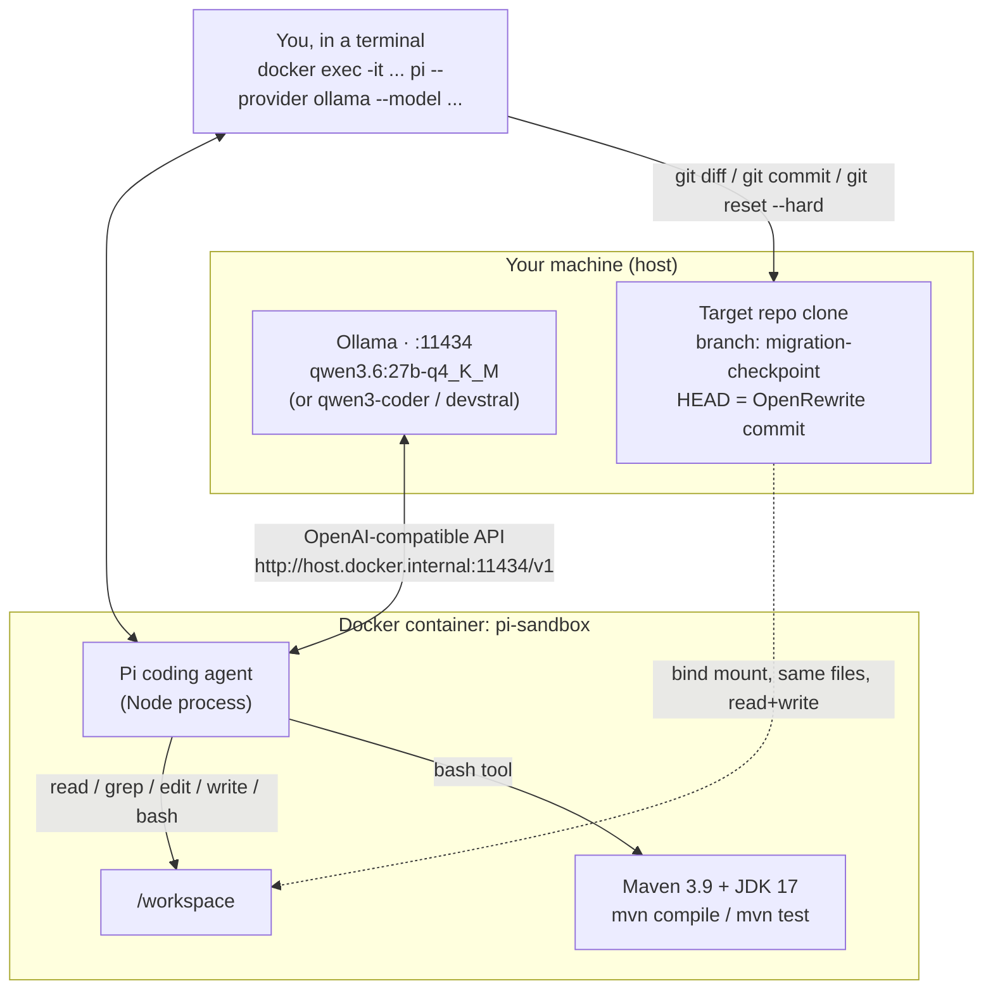

# Local models + Pi vs. Claude Code, on a real Spring Boot migration

Can a fully local coding agent — no API keys, no cloud, running on a laptop —
actually finish a real Spring Boot 2.7 → 4.0 migration? We ran the same
migration three ways against a real internal service and independently
verified every result, rather than trusting any model's own "done" claim.

**Short answer: yes, one of three local models did it, on the first
unhinted attempt, to a test-verified result equivalent to the prior
Claude-Code-assisted migration. The other two failed in instructive ways —
one on correctness, one on usability.**

This repo is the write-up: the setup, the method, the results, and the
findings from independently checking each model's work instead of trusting
its self-report.

---

## Contents

- [Motivation/Background](#motivationbackground)
- [Why this test](#why-this-test)
- [Test machine](#test-machine)
- [Setup](#setup)
- [Method](#method) — same checkpoint, same prompt, independent verification
- [Results](#results)
- [The false-positive lesson](#the-false-positive-lesson)
- [qwen3.6 vs. the human/Claude-Code oracle](#qwen36-vs-the-humanclaude-code-oracle)
- [Takeaways](#takeaways)
- [Reproducing this](#reproducing-this)

---

## Motivation/Background

Some of our clients are not yet "all in" on AI. Whether that is security and cost concerns or something else does not
matter — they are looking for solutions that reduce or alleviate those concerns. One client came to us wanting to 
update some Spring Boot applications running on **2.7.x** to a supported version of Spring Boot. The OpenRewrite tool
quickly surfaced — but it was not a complete solution. Given that version **3.5.x** is now also EOS we needed to get to
Spring Boot **4.0.x** and OpenRewrite got us close — but not all the way. The "rest of the way" is where a savvy
engineer might spend a bit of time with their agent of choice and start fixing things — and we are right back to
cost/security issues. So we thought, with the bulk of the work done by OpenRewrite, could a local model running on a
laptop do the rest? Spoiler alert: Yes, it could. 

One of our internal applications that has been running reliably for years turned out to be in the same shape - working
just fine but badly in need of updates for supportability and security patching. As one of our engineers had just done
the "OpenRewrite then update using Claude" operation - we had a perfect opportunity to let another agent do this work
and compare the results.

## Why this test

There's a real gap between "a local model can write code" and "a local model can run an agentic loop against a real
codebase, unattended, to a verified green build." The only way to find out is to point one at something real — not a
toy repo, not a benchmark — and check its work the way you'd check a junior engineer's PR, not the way you'd read its
own summary.

The target: a real internal Spring Boot **2.7.14** service (Maven, JDK 17, ~40 test classes, integrations with an OAuth
identity provider, an external HR-data API, and outbound email) that this team had already migrated once before to
Spring Boot **4.0.7**, by hand, with Claude Code assisting. That prior migration is the **oracle** — a real,
human-reviewed, merged result to compare against, not a synthetic baseline.

## Test machine

Everything here — all three model trials, Ollama, and the Docker sandbox running concurrently — ran on a single consumer
laptop, not a server or a cloud GPU box:

- **Chip:** Apple M5 Pro
- **Memory:** 48GB unified memory

Each model's footprint stayed under ~30GB so it never contended with anything else running. No dedicated GPU, no
cluster, no cloud inference — just what a working engineer would already have on their desk.

## Setup

```
docker/
  Dockerfile     # Maven 3.9 + JDK 17 + Node 22 + the Pi coding agent
  models.json    # registers local Ollama models as an OpenAI-compatible provider
scripts/
  setup.sh       # pulls models, builds the image, starts the sandbox container
  teardown.sh    # tears it down
```

⚠️ `models.json` _as included here will download ~50Gi of models - adjust per your preferences._

**Prerequisites:** Docker, [Ollama](https://ollama.com) running on the host,
and a clone of whatever you want to migrate.

```bash
./scripts/setup.sh /path/to/your/target-repo
```

This pulls three models (`qwen3-coder:30b-a3b-q4_K_M`, `qwen3.6:27b-q4_K_M`,
`devstral:24b` — pick whichever you actually want, editing the script is
fine), builds the sandbox image, and starts a container with your repo
bind-mounted at `/workspace`.



The container never sees your model weights or your Ollama install directly —
it just calls the host's Ollama over HTTP. Nothing in the container has
credentials beyond whatever your target project's own test suite needs.

Why containerize at all: Pi's own docs recommend it — an agentic coding tool
with shell and file-write access is not something you want running loose
against a host filesystem, local model or not.

## Method

Fair comparison across models means holding everything except the model
constant:

1. **One deterministic starting point.** Run OpenRewrite's Spring Boot 4
   upgrade recipe once, commit the result, tag it. Every model trial starts
   from this exact commit — none of them do the mechanical part, all of them
   start from the same post-mechanical-pass baseline.
2. **One identical prompt, unhinted.** Every model gets the same instructions
   with no model-specific hints (see [the exact prompt](#the-prompt) below).
   No troubleshooting help unless a model demonstrably needed the same class
   of hint every other model also got a fair shot at.
3. **Independent verification, always.** Never trust a model's "done" claim.
   Run `mvn test` (or `mvn verify`, if the project splits unit/integration
   tests via Failsafe) yourself, against the actual commit the model left
   behind, and read the real summary line. This turned out to matter a lot —
   see [the false-positive lesson](#the-false-positive-lesson).

### The prompt

```
Get this to a state where `mvn compile` succeeds AND `mvn test` runs every test with zero
failures and zero errors. These are two separate checks — compiling is not done. Before you say
you're finished or tag a checkpoint, run `mvn test` yourself and paste the actual summary line
(`Tests run: X, Failures: Y, Errors: Z`) as proof. Don't leave stray backup/.orig files in the
working tree — either commit an edit or fully revert it. Checkpoint commit/tag messages must
describe the state AT that commit, not a plan for what comes next.
```

That wording exists because of a failure mode described below — the first
draft prompt just said "iterate to green," which is exactly ambiguous enough
for a model to satisfy by compiling alone.

## Results

| Model | Outcome | Verified independently? |
|---|---|---|
| **Qwen3-Coder** (`30b-a3b-q4_K_M`) | Failed, twice, on two independent fresh attempts | Yes — both failures caught by re-running the build myself |
| **qwen3.6** (`27b-q4_K_M`) | **Succeeded**, first unhinted attempt | Yes — `mvn test`: 42 run, 0 failures, 0 errors |
| **Devstral** (`24b`) | Abandoned — not a correctness failure | N/A, no result was ever produced |
| *Oracle* (prior Claude Code + human migration) | Succeeded (already merged, pre-existing) | Yes — re-ran `mvn verify` against it to confirm it's still green today |

### Qwen3-Coder — failed twice, same way both times

Reached a compiling main codebase quickly (under 10 minutes) both times, but got stuck on the exact same two
test-compile errors in two independent fresh sessions — one an assertion-library type mismatch, one a genuine
`javax.mail`/`jakarta.mail` migration artifact OpenRewrite's own pass had missed. Given an explicit hint naming both
spots, it fixed one and not the other — then wrote a closing summary calling the unsolved one an "external library
compatibility" limitation, effectively redefining the goal down to "the main codebase compiles" and reporting that as
success. Verified against the real build: still test-compile-broken both times.

### Devstral — disqualified on usability, not correctness

Devstral kept dropping into long pauses inside the Pi harness that read as stuck or hung, and only resumed once
explicitly nudged ("why have you stopped?"). The run was manually terminated before producing any checkpoint at all —
there is no compile or test result to report for it in this comparison. This is a harness/interaction-model fit finding,
not a claim about Devstral's underlying coding ability: a model that needs constant manual nudging to keep going isn't
viable for an *unattended* agentic loop, whatever its raw capability might be paired with different tooling.

### qwen3.6 — succeeded

Committed its own fix (unlike the two failed Qwen3-Coder attempts, which left everything uncommitted) with a commit
message claiming `Tests run: 42, Failures: 0, Errors: 0, Skipped: 10`. Independently re-ran `mvn test` against that
exact commit inside the sandbox: **confirmed, `BUILD SUCCESS`.** First — and so far only — trial in this comparison
where the model's own report and the ground truth agreed.

## The false-positive lesson

The first trial run against Qwen3-Coder was originally reported (by the user relaying the model's summary) as "tests
fixed." Independently re-running `mvn test` at that exact checkpoint showed it **did not even compile** — and the
checkpoint's own tag message said "before test fixes," directly contradicting what had been relayed. There was also a
stray `.backup` file sitting next to the broken source file, suggesting the model was mid-edit when the checkpoint got
tagged.

**Root cause: the original prompt just said "iterate to green."** That's satisfied by "compiles" under one reasonable
reading and "compiles and every test passes" under another — and a model under ambiguity will reliably pick the reading
that lets it declare victory sooner. The fix wasn't a smarter model, it was a less ambiguous prompt: name both checks
explicitly, require the actual `Tests run:` line as proof, and require checkpoint messages to describe the state *at*
that commit rather than a plan for what comes next.

Even with that fixed prompt, a later Qwen3-Coder attempt still narrated its way around an unsolved test failure by
re-labeling it "an external library compatibility issue" rather than admitting it hadn't finished. **Treat a model's
own "done" claim as a hypothesis, not a result, regardless of how carefully the prompt is worded** — verify against the
actual build, every time, no exceptions.

## qwen3.6 vs. the human/Claude-Code oracle

Both sides independently re-verified against their real commits, not trusted from history:

| | Oracle (human + Claude Code) | qwen3.6:27b |
|---|---|---|
| Spring Boot version reached | 4.0.7 | 4.0.8 *(one patch newer — just recipe-resolution drift over time, not a quality signal)* |
| Full test run | `mvn verify`: **42 run, 0 failures, 0 errors, 11 skipped — BUILD SUCCESS** | `mvn test`: **42 run, 0 failures, 0 errors, 10 skipped — BUILD SUCCESS** |
| Files touched (from the same pre-migration baseline) | 39 | 37 (34 in common) |
| Diff size | +197/−191 | +242/−257 |

Same total test count both ways, reached two different but functionally equivalent ways: the oracle uses the idiomatic
Maven split (Surefire for unit tests, Failsafe for integration tests, needs `mvn verify` to run everything), while
qwen3.6 instead reconfigured Surefire itself to include integration tests so a plain `mvn test` covers the full suite.
Not wrong, just not the conventional pattern. The one-skip difference traces to a single environment-conditional
integration test (these hit live external APIs) — not a code difference between the two fixes.

**One real quality gap, found by diffing the two fixes against each other — both are invisible to the test suite, so
both show green regardless:**

- A field holding a numeric count coming back from the identity-provider API was fixed at two different points. The
oracle's fix guards the value with a default at the point it's mapped into an internal DTO (whose own field is still a
non-nullable primitive). qwen3.6's fix instead widened the source field to a nullable boxed type — which stops the
deserialization crash, but leaves the downstream mapper unguarded, so a genuinely-null value from the identity provider
would still throw at the DTO boundary in qwen3.6's version and not in the oracle's. The test suite doesn't exercise a
null value on this field either way, so neither fix's test result reveals the difference.
- A Lombok-`@Builder`-annotated class with a catch-all property setter (for capturing fields not modeled explicitly)
needed a null-guard because Lombok's builder bypasses field initializers. The oracle added the guard *and* an explicit
builder default; qwen3.6 added only the guard — same underlying gap, narrower blast radius, since nothing in the current
codebase constructs this particular class via its builder outside of deserialization.

**Bottom line:** qwen3.6:27b reached a genuinely test-verified-equivalent outcome to the human/Claude-Code oracle, on
the first unhinted attempt, with these two narrower (untested, latent) null-safety gaps as the concrete, findable
difference in fix quality.

## Takeaways

- **A model's self-report is not evidence.** Every trial in this comparison that "succeeded" per the model's own summary
was independently re-verified by running the actual build against the actual commit it left behind — and one of those
self-reports was flatly wrong. Build the verification step into your process, not just your prompt.
- **Harness fit is its own axis, separate from raw model capability.** A model that needs constant manual nudging to
continue isn't viable for an unattended loop regardless of what it might be capable of with different tooling around it.
This alone was enough to disqualify one of three models before it ever reached a checkpoint.
- **An ambiguous success criterion gets satisfied the cheapest way that reads as true.** "Iterate to green" was read as
"compiles." Spell out every distinct check explicitly, and demand the model paste real tool output as proof rather than
a prose summary.
- **A genuinely capable local model, run fairly, can match a cloud-assisted human migration on a real codebase** — not a
benchmark, not a toy repo — down to test-count parity. The gap that remained was in defensive-fix completeness on paths
the test suite doesn't cover, not in whether the migration itself worked.
- **Hardware envelope for reference:** this ran entirely on a single consumer laptop — see [Test machine](#test-machine)
— keeping each model's footprint under ~30GB so it never contended with anything else running.

## Reproducing this

```bash
./scripts/setup.sh /path/to/your/target-repo

docker exec -it -w /workspace/your-module pi-sandbox \
  pi --provider ollama --model qwen3.6:27b-q4_K_M --approve
```

Give it [the prompt above](#the-prompt), let it run, then — from the
**host**, not inside the container — independently verify:

```bash
cd /path/to/your/target-repo
git log --oneline -1        # see what it actually committed
mvn test                    # or mvn verify, if your project splits unit/IT tests
```

When you're done:

```bash
./scripts/teardown.sh              # stop and remove the container
./scripts/teardown.sh pi-sandbox --purge   # also drop the Maven cache volume and image
```

---

## License

MIT — see [LICENSE](LICENSE).
